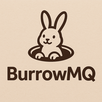

<p align="right">
  📄 <a href="README.md">🇷🇺 Русский</a> | <a href="README.en.md">🇬🇧 English</a>
</p>

<p align="center">
  
</p>

# 🐰 BurrowMQ Server — минимальный AMQP 0.9.1 сервер на Rust

**BurrowMQ** — это легковесная асинхронная реализация сервера AMQP 0.9.1 на языке Rust.\
Проект совместим с AMQP-клиентами, такими как [`lapin`](https://github.com/CleverCloud/lapin), и поддерживает базовые возможности очередей, обменников и доставки сообщений.


> 🦀 BurrowMQ — проект для обучения, экспериментов и глубокого понимания протокола AMQP внутри и снаружи. Также может быть полезен для практики и изучения асинхронного программирования и архитектурных подходов в языке Rust.

> 🕳️ Почему Burrow? Название проекта происходит от английского слова "burrow" — нора, подземный тоннель, где прячутся кролики. Подобно кролику из RabbitMQ, BurrowMQ — это минималистичная реализация AMQP, работающая "вглубь" протокола, предоставляя базовую инфраструктуру доставки сообщений. Это отсылка к корням протокола RabbitMQ, но в более упрощённой и понятной форме — для обучения и экспериментов.
> 
> 🤓 Дополнительно, в названии обыгрывается созвучие со словом borrow (как в borrow checker в Rust). Хотя это и игра слов, BurrowMQ также может служить хорошим способом попрактиковаться в понимании владения, заимствования и асинхронного взаимодействия в стиле Rust.

---

## ✨ Возможности

- ✅ Объявление очередей (`queue.declare`)
- ✅ Объявление обменников (`exchange.declare`) — `direct`, `fanout`
- ✅ Привязки очередей к обменникам (`queue.bind`)
- ✅ Публикация сообщений (`basic.publish`), включая базовые примеры с `direct` exchange и `default exchange` (`exchange = ""`, `routing_key = queue_name`)
- ✅ Подписка на очередь и получение сообщений (`basic.consume`)
- ✅ Поддержка Heartbeat-сообщений
- ✅ Асинхронная реализация на `tokio`
- 🧪 Интеграционные тесты с `lapin`

---

## 🚀 Быстрый старт

### Запуск сервера

```bash
cargo run -- --port 5672
```

Сервер будет слушать подключения на `127.0.0.1:5672`.

---

## 🧪 Тестирование

В проекте присутствуют интеграционные тесты, написанные с использованием `lapin` — полноценного AMQP 0.9.1 клиента на Rust.

...

## ❌ Что пока не реализовано

- `exchange` типа `topic`, `headers`
- `exchange.bind`, `exchange.unbind`
- подтверждение сообщений (`publisher confirms`) — `confirm.select`, `basic.ack` с трекингом `delivery_tag`
- удаление очередей (`queue.delete`)
- `basic.reject`, `basic.nack`
- QoS (`basic.qos`)
- аутентификация (`connection.start-ok` → login/password)
- персистентность сообщений (на диск)
- кластеризация и federation
- Web UI или мониторинг

---


## ⚖️ Лицензия

MIT